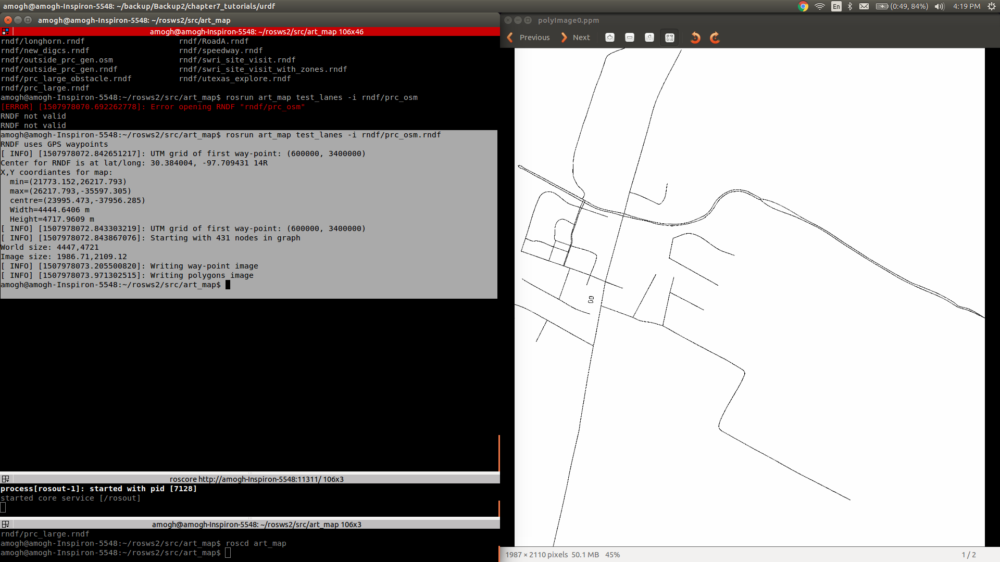

## Parsing and Plotting an RNDF (ROS package)

Catkinised version of the packages art_map, art_common, art_msgs from original rosbuild version available at https://github.com/austin-robot/utexas-art-ros-pkg
To see the RNDF as a plotted image, first go to art_map package:

```
roscd art_map
```
Use the following command, which runs the node test_lanes with image flag and publishes a .ppm image
```
rosrun art_map test_lanes -i rndf/prc_osm.rndf
```
Here is a screenshot:




